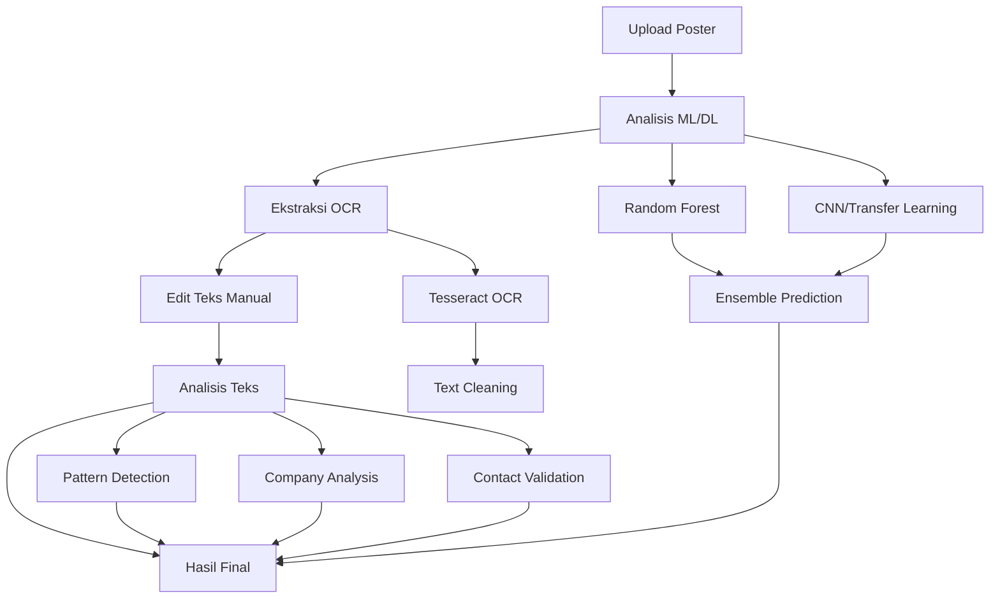

# CekAjaYuk - Quick Start Guide

## 🚀 Panduan Cepat Memulai

### 1. Setup Awal (5 menit)

```bash
# 1. Install dependencies
python setup.py

# 2. Install Tesseract OCR
# Windows: Download dari https://github.com/UB-Mannheim/tesseract/wiki
# Linux: sudo apt-get install tesseract-ocr tesseract-ocr-ind
# macOS: brew install tesseract tesseract-lang

# 3. Train models (opsional - akan menggunakan demo data jika dilewati)
python train_models.py
```

### 2. Jalankan Aplikasi (1 menit)

```bash
# Jalankan aplikasi
python run.py

# Pilih opsi 3: "Run backend and open frontend"
```

### 3. Gunakan Aplikasi (2 menit)

1. **Upload Poster**: Drag & drop atau klik untuk upload gambar poster lowongan kerja
2. **Analisis Otomatis**: Sistem akan menganalisis dengan ML/DL
3. **OCR Ekstraksi**: Teks akan diekstrak dari gambar
4. **Edit Teks** (opsional): Koreksi hasil OCR jika diperlukan
5. **Hasil Final**: Lihat analisis lengkap dan rekomendasi

## 🎯 Fitur Utama

### Analisis Multi-Layer
- **🤖 Machine Learning**: Random Forest Classifier untuk fitur tradisional
- **🧠 Deep Learning**: CNN dengan transfer learning
- **📝 Text Analysis**: Analisis pola mencurigakan dalam teks
- **👁️ OCR**: Ekstraksi teks dengan Tesseract (Indonesia + English)

### Interface User-Friendly
- **📱 Responsive Design**: Bekerja di desktop dan mobile
- **⚡ Real-time Progress**: Indikator progress untuk setiap tahap
- **🎨 Modern UI**: Interface yang clean dan mudah digunakan
- **📊 Detailed Results**: Hasil analisis yang komprehensif

## 🔧 Struktur Proyek

```
cekajayuk/
├── 🌐 frontend/          # Interface web (HTML/CSS/JS)
├── ⚙️ backend/           # API Flask + ML/DL models
├── 📓 notebooks/         # Jupyter notebooks untuk training
├── 🤖 models/           # Model ML/DL yang telah dilatih
├── 📁 uploads/          # File yang diupload user
├── 📊 static/           # CSS, JS, images
├── 🚀 run.py            # Script untuk menjalankan aplikasi
├── ⚡ setup.py          # Setup dependencies
└── 🧪 test_api.py       # Testing API endpoints
```

## 🛠️ API Endpoints

| Endpoint | Method | Deskripsi |
|----------|--------|-----------|
| `/` | GET | Health check |
| `/api/models/info` | GET | Info model yang dimuat |
| `/api/analyze-image` | POST | Analisis gambar dengan ML/DL |
| `/api/extract-text` | POST | Ekstraksi teks dengan OCR |
| `/api/analyze-text` | POST | Analisis teks untuk pola mencurigakan |
| `/api/analyze-complete` | POST | Analisis lengkap (gambar + OCR + teks) |

## 🧪 Testing

```bash
# Test semua endpoint API
python test_api.py

# Test manual dengan curl
curl -X POST -F "file=@poster.jpg" http://localhost:5000/api/analyze-complete
```

## 📋 Workflow Analisis



## ⚠️ Troubleshooting

### Backend tidak bisa diakses
```bash
# Pastikan Flask berjalan
python backend/app.py

# Check port 5000
netstat -an | grep 5000
```

### Tesseract error
```bash
# Windows: Add ke PATH
set PATH=%PATH%;C:\Program Files\Tesseract-OCR

# Linux: Install language pack
sudo apt-get install tesseract-ocr-ind tesseract-ocr-eng

# Test Tesseract
tesseract --version
```

### Model tidak ditemukan
```bash
# Train models
python train_models.py

# Atau gunakan demo mode (otomatis jika model tidak ada)
```

### File upload error
- Pastikan file < 16MB
- Format yang didukung: JPG, PNG, PDF
- Check browser console untuk error detail

## 🎨 Kustomisasi

### Mengubah Model
```python
# Edit backend/models.py
class ModelManager:
    def load_models(self):
        # Tambah model custom Anda di sini
        pass
```

### Mengubah UI
```css
/* Edit static/css/style.css */
.upload-area {
    /* Kustomisasi tampilan upload */
}
```

### Menambah Bahasa OCR
```python
# Edit backend/config.py
TESSERACT_CONFIG = r'--oem 3 --psm 6 -l ind+eng+fra'  # Tambah bahasa Prancis
```

## 📈 Performance Tips

### Optimasi Model
- Gunakan model quantization untuk inference lebih cepat
- Cache model di memory untuk startup lebih cepat
- Gunakan GPU jika tersedia

### Optimasi OCR
- Preprocessing gambar untuk hasil OCR lebih baik
- Adjust PSM (Page Segmentation Mode) sesuai jenis gambar
- Gunakan whitelist karakter untuk domain spesifik

### Optimasi Web
- Compress gambar sebelum upload
- Gunakan CDN untuk static files
- Implement caching untuk hasil analisis

## 🔒 Security Notes

- File upload dibatasi ukuran dan tipe
- Input validation pada semua endpoint
- Rate limiting untuk mencegah abuse
- Secure file storage dengan cleanup otomatis

## 📞 Support

- **📧 Email**: support@cekajayuk.com
- **📖 Dokumentasi**: Lihat DOCUMENTATION.md
- **🐛 Bug Report**: Buat issue di GitHub
- **💡 Feature Request**: Diskusi di GitHub Discussions

## 🎯 Next Steps

1. **Improve Models**: Kumpulkan data real untuk training yang lebih baik
2. **Add Features**: Implementasi fitur tambahan seperti batch processing
3. **Deploy**: Deploy ke cloud untuk akses publik
4. **Monitor**: Implementasi monitoring dan logging
5. **Scale**: Optimasi untuk handle traffic tinggi

---

**Happy Detecting! 🕵️‍♂️ Lindungi diri dari lowongan kerja palsu dengan CekAjaYuk!**
