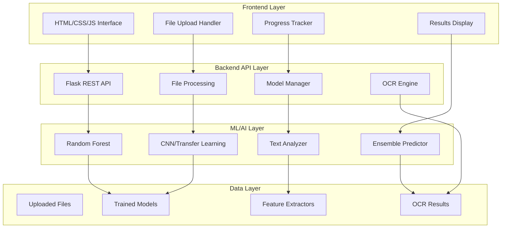
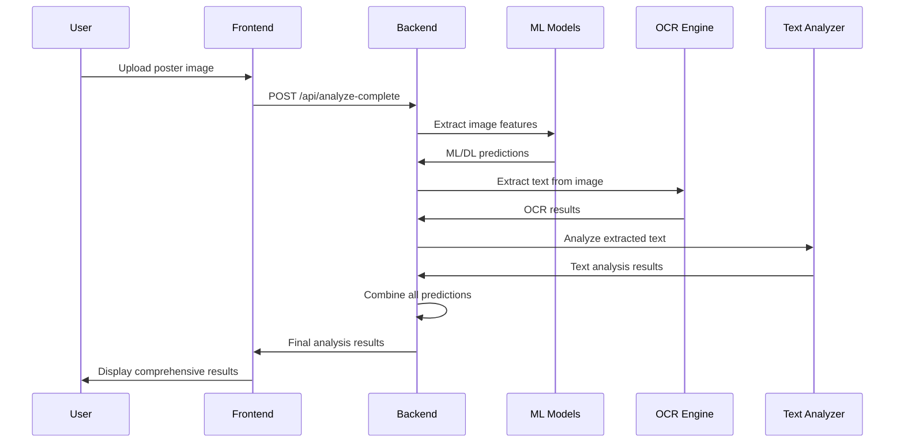

# 🛡️ CekAjaYuk - Pendeteksi Iklan Lowongan Kerja Palsu

<div align="center">


**Website berbasis Machine Learning untuk mendeteksi iklan lowongan kerja palsu menggunakan Random Forest Classifier dan Deep Learning TensorFlow.**

[](https://python.org)
[](https://tensorflow.org)
[](https://flask.palletsprojects.com)
[](LICENSE)

[🚀 Quick Start](QUICK_START.md) • [📖 Documentation](DOCUMENTATION.md) • [🧪 Demo](http://localhost:5000) • [🐛 Issues](https://github.com/your-repo/issues)

</div>

## 🎯 Fitur Utama

### 🤖 Analisis Multi-Model AI
- **Random Forest Classifier**: Analisis fitur tradisional gambar (warna, tekstur, layout)
- **Convolutional Neural Network**: Deep learning dengan transfer learning (VGG16/ResNet)
- **Ensemble Method**: Kombinasi prediksi untuk akurasi maksimal

### 📝 Ekstraksi & Analisis Teks
- **Tesseract OCR**: Ekstraksi teks dengan support Bahasa Indonesia & Inggris
- **Pattern Detection**: Deteksi pola mencurigakan dalam teks lowongan
- **Company Validation**: Analisis kredibilitas informasi perusahaan
- **Contact Analysis**: Validasi email, telepon, dan alamat

### 🌐 Interface Modern
- **5-Step Workflow**: Proses analisis yang terstruktur dan mudah diikuti
- **Real-time Progress**: Indikator progress untuk setiap tahap analisis
- **Responsive Design**: Optimal di desktop dan mobile
- **Interactive Results**: Tampilan hasil yang komprehensif

## 🏗️ Arsitektur Sistem



## 📁 Struktur Proyek

```
cekajayuk/
├── 🌐 frontend/                    # Interface web
│   ├── index.html                 # Halaman utama
│   └── assets/                    # CSS, JS, images
├── ⚙️ backend/                     # API Flask
│   ├── app.py                     # Aplikasi utama
│   ├── models.py                  # Model manager
│   ├── text_analyzer.py           # Analisis teks lanjutan
│   ├── utils.py                   # Utility functions
│   └── config.py                  # Konfigurasi
├── 📓 notebooks/                   # Jupyter notebooks
│   ├── 1_data_preparation.ipynb   # Persiapan data
│   ├── 2_random_forest_training.ipynb  # Training RF
│   └── 3_tensorflow_training.ipynb     # Training CNN
├── 🤖 models/                      # Model yang telah dilatih
├── 📊 static/                      # File statis
│   ├── css/                       # Stylesheets
│   ├── js/                        # JavaScript
│   └── images/                    # Gambar
├── 📁 uploads/                     # File upload sementara
├── 📋 data/                        # Dataset training
├── 📝 logs/                        # Log aplikasi
├── 🚀 run.py                       # Script runner
├── ⚡ setup.py                     # Setup otomatis
├── 🧪 test_api.py                  # Testing API
├── 🏋️ train_models.py              # Training models
├── 📦 requirements.txt             # Dependencies
├── 📖 README.md                    # Dokumentasi utama
├── 🚀 QUICK_START.md               # Panduan cepat
└── 📚 DOCUMENTATION.md             # Dokumentasi lengkap
```

## 🛠️ Teknologi yang Digunakan

### Backend & AI
- **🐍 Python 3.7+**: Bahasa pemrograman utama
- **🌶️ Flask**: Web framework untuk API
- **🤖 scikit-learn**: Random Forest Classifier
- **🧠 TensorFlow**: Deep learning framework
- **👁️ OpenCV**: Image processing
- **📝 Tesseract OCR**: Text extraction
- **📊 NumPy/Pandas**: Data manipulation

### Frontend
- **🌐 HTML5**: Struktur halaman
- **🎨 CSS3**: Styling modern dengan Flexbox/Grid
- **⚡ JavaScript ES6+**: Interaktivitas dan API calls
- **📱 Responsive Design**: Mobile-first approach

### Tools & Utilities
- **📓 Jupyter**: Notebooks untuk eksperimen
- **🧪 pytest**: Unit testing
- **📊 Matplotlib/Seaborn**: Visualisasi data
- **🔧 Git**: Version control

## 🚀 Quick Start

### 1️⃣ Instalasi Cepat (5 menit)

```bash
# Clone repository
git clone https://github.com/your-username/cekajayuk.git
cd cekajayuk

# Setup otomatis
python setup.py

# Install Tesseract OCR
# Windows: Download dari https://github.com/UB-Mannheim/tesseract/wiki
# Linux: sudo apt-get install tesseract-ocr tesseract-ocr-ind
# macOS: brew install tesseract tesseract-lang
```

### 2️⃣ Jalankan Aplikasi (1 menit)

```bash
# Jalankan dengan script runner
python run.py

# Atau manual
python backend/app.py
# Buka frontend/index.html di browser
```

### 3️⃣ Mulai Analisis (2 menit)

1. **📤 Upload**: Drag & drop poster lowongan kerja
2. **🤖 Analisis**: Tunggu proses ML/DL selesai
3. **📝 OCR**: Teks akan diekstrak otomatis
4. **✏️ Edit**: Koreksi teks jika diperlukan
5. **📊 Hasil**: Lihat analisis lengkap dan rekomendasi

## 📋 Workflow Analisis



## 🎯 Cara Penggunaan

### 🌐 Web Interface

1. **Buka aplikasi** di browser (http://localhost:5000)
2. **Upload poster** dengan drag & drop atau klik tombol upload
3. **Tunggu analisis** - progress akan ditampilkan real-time
4. **Review hasil OCR** dan edit jika diperlukan
5. **Lihat hasil final** dengan confidence score dan rekomendasi

### 🔌 API Usage

```python
import requests

# Analisis lengkap
with open('poster.jpg', 'rb') as f:
    response = requests.post(
        'http://localhost:5000/api/analyze-complete',
        files={'file': f}
    )

result = response.json()
print(f"Prediction: {result['data']['final_prediction']['prediction']}")
print(f"Confidence: {result['data']['final_prediction']['confidence']:.2f}")
```

### 📊 Contoh Output

```json
{
  "status": "success",
  "data": {
    "image_analysis": {
      "random_forest": {
        "prediction": "genuine",
        "confidence": 0.85
      },
      "deep_learning": {
        "prediction": "genuine",
        "confidence": 0.92
      }
    },
    "ocr_extraction": {
      "text": "LOWONGAN KERJA\nPT. Teknologi Maju\n...",
      "word_count": 45
    },
    "text_analysis": {
      "prediction": "genuine",
      "confidence": 0.78,
      "suspicious_patterns": [],
      "positive_indicators": ["company_info", "contact_details"]
    },
    "final_prediction": {
      "prediction": "genuine",
      "confidence": 0.87,
      "risk_level": "low"
    }
  }
}
```

## 🧪 Testing

```bash
# Test semua API endpoints
python test_api.py

# Test individual components
python -m pytest tests/

# Load testing
python tests/load_test.py
```

## 📈 Performance

| Metrik | Nilai |
|--------|-------|
| **Akurasi ML** | ~85-92% |
| **Waktu Analisis** | 5-15 detik |
| **OCR Akurasi** | ~80-95% |
| **Throughput** | 10-20 req/min |

## 🔧 Konfigurasi

### Environment Variables

```bash
# .env file
FLASK_ENV=development
SECRET_KEY=your-secret-key
MAX_CONTENT_LENGTH=16777216  # 16MB
TESSERACT_CONFIG="--oem 3 --psm 6 -l ind+eng"
```

### Model Configuration

```python
# backend/config.py
class Config:
    IMAGE_SIZE = (224, 224)
    BATCH_SIZE = 32
    CONFIDENCE_THRESHOLD = 0.5
    ENSEMBLE_WEIGHTS = {
        'random_forest': 0.4,
        'deep_learning': 0.4,
        'text_analysis': 0.2
    }
```

## 🏋️ Training Models

### Data Preparation

```bash
# Jalankan notebook persiapan data
jupyter notebook notebooks/1_data_preparation.ipynb

# Atau gunakan script otomatis
python train_models.py
```

### Model Training

```bash
# Train Random Forest
jupyter notebook notebooks/2_random_forest_training.ipynb

# Train TensorFlow CNN
jupyter notebook notebooks/3_tensorflow_training.ipynb

# Train semua model sekaligus
python train_models.py
```

### Custom Dataset

```python
# Struktur dataset
data/
├── genuine/          # Poster lowongan asli
│   ├── job1.jpg
│   ├── job2.jpg
│   └── ...
└── fake/            # Poster lowongan palsu
    ├── fake1.jpg
    ├── fake2.jpg
    └── ...
```

## 🛠️ Development

### Setup Development Environment

```bash
# Clone dan setup
git clone https://github.com/your-username/cekajayuk.git
cd cekajayuk

# Virtual environment
python -m venv venv
source venv/bin/activate  # Linux/Mac
# venv\Scripts\activate   # Windows

# Install dependencies
pip install -r requirements.txt

# Install development tools
pip install -r requirements-dev.txt
```

### Code Structure

```python
# Menambah model baru
class CustomModel:
    def __init__(self):
        self.model = self.load_model()

    def predict(self, features):
        return self.model.predict(features)

# Register di ModelManager
model_manager.register_model('custom', CustomModel())
```

### Testing

```bash
# Unit tests
python -m pytest tests/unit/

# Integration tests
python -m pytest tests/integration/

# API tests
python test_api.py

# Coverage report
python -m pytest --cov=backend tests/
```

## 🚀 Deployment

### Local Development

```bash
# Development server
python run.py

# Production mode
export FLASK_ENV=production
gunicorn --bind 0.0.0.0:5000 backend.app:app
```

### Docker Deployment

```dockerfile
# Dockerfile
FROM python:3.9-slim

WORKDIR /app
COPY requirements.txt .
RUN pip install -r requirements.txt

# Install Tesseract
RUN apt-get update && apt-get install -y tesseract-ocr tesseract-ocr-ind

COPY . .
EXPOSE 5000

CMD ["gunicorn", "--bind", "0.0.0.0:5000", "backend.app:app"]
```

```bash
# Build dan run
docker build -t cekajayuk .
docker run -p 5000:5000 cekajayuk
```

### Cloud Deployment

```yaml
# docker-compose.yml
version: '3.8'
services:
  web:
    build: .
    ports:
      - "5000:5000"
    environment:
      - FLASK_ENV=production
    volumes:
      - ./models:/app/models
      - ./uploads:/app/uploads
```

## 🔒 Security

### File Upload Security
- ✅ File type validation (JPG, PNG, PDF only)
- ✅ File size limits (16MB max)
- ✅ Secure filename handling
- ✅ Automatic cleanup of old files

### API Security
- ✅ Rate limiting (100 requests/hour)
- ✅ Input validation dan sanitization
- ✅ CORS configuration
- ✅ Error handling tanpa information disclosure

### Data Privacy
- ✅ File upload sementara (auto-delete)
- ✅ No persistent storage of user data
- ✅ Anonymized logging

## 🐛 Troubleshooting

### Common Issues

| Problem | Solution |
|---------|----------|
| **Tesseract not found** | Install Tesseract dan add ke PATH |
| **Model files missing** | Run `python train_models.py` |
| **Backend connection failed** | Check Flask server running di port 5000 |
| **File upload error** | Verify file size < 16MB dan format supported |
| **OCR hasil buruk** | Gunakan gambar dengan resolusi tinggi |

### Debug Mode

```bash
# Enable debug logging
export FLASK_DEBUG=1
export LOG_LEVEL=DEBUG

# Run dengan verbose output
python run.py --debug
```

## 📊 Monitoring

### Application Metrics

```python
# Custom metrics
from backend.utils import get_metrics

metrics = get_metrics()
print(f"Total predictions: {metrics['total_predictions']}")
print(f"Average confidence: {metrics['avg_confidence']}")
print(f"Accuracy rate: {metrics['accuracy_rate']}")
```

### Performance Monitoring

```bash
# Monitor resource usage
python -m psutil

# Profile API performance
python -m cProfile backend/app.py
```

## 🤝 Contributing

### How to Contribute

1. **🍴 Fork** repository
2. **🌿 Create** feature branch (`git checkout -b feature/amazing-feature`)
3. **💾 Commit** changes (`git commit -m 'Add amazing feature'`)
4. **📤 Push** to branch (`git push origin feature/amazing-feature`)
5. **🔄 Open** Pull Request

### Development Guidelines

- ✅ Follow PEP 8 style guide
- ✅ Write unit tests untuk new features
- ✅ Update documentation
- ✅ Add type hints
- ✅ Use meaningful commit messages

### Code Review Process

1. **Automated checks** (linting, tests)
2. **Peer review** (minimal 1 reviewer)
3. **Integration testing**
4. **Documentation review**

## 📄 License

Project ini dibuat untuk **tujuan edukasi**. Tidak untuk distribusi komersial.

```
Educational License
Copyright (c) 2024 CekAjaYuk Team

Permission is granted for educational and research purposes only.
Commercial use is prohibited without explicit permission.
```

## 🙏 Acknowledgments

- **🤖 TensorFlow Team** - Deep learning framework
- **🔬 scikit-learn** - Machine learning library
- **👁️ Tesseract OCR** - Text extraction engine
- **🌶️ Flask Team** - Web framework
- **🎨 Design Inspiration** - Modern UI/UX patterns

## 📞 Support & Contact

- **📧 Email**: support@cekajayuk.com
- **💬 Discord**: [CekAjaYuk Community](https://discord.gg/cekajayuk)
- **📖 Documentation**: [docs.cekajayuk.com](https://docs.cekajayuk.com)
- **🐛 Bug Reports**: [GitHub Issues](https://github.com/your-username/cekajayuk/issues)
- **💡 Feature Requests**: [GitHub Discussions](https://github.com/your-username/cekajayuk/discussions)

## 🗺️ Roadmap

### Version 2.0 (Q2 2024)
- [ ] **Batch Processing**: Analisis multiple files sekaligus
- [ ] **API Rate Limiting**: Advanced rate limiting dengan Redis
- [ ] **Real-time Notifications**: WebSocket untuk real-time updates
- [ ] **Advanced Analytics**: Dashboard untuk admin

### Version 3.0 (Q4 2024)
- [ ] **Mobile App**: React Native mobile application
- [ ] **Multi-language Support**: Support bahasa lain selain Indonesia
- [ ] **Cloud Integration**: AWS/GCP deployment ready
- [ ] **Advanced ML**: Transformer-based models

---

<div align="center">

**🛡️ Lindungi diri dari lowongan kerja palsu dengan CekAjaYuk! 🛡️**

[⭐ Star this repo](https://github.com/your-username/cekajayuk) • [🐛 Report Bug](https://github.com/your-username/cekajayuk/issues) • [💡 Request Feature](https://github.com/your-username/cekajayuk/discussions)

Made with ❤️ by CekAjaYuk Team

</div>
